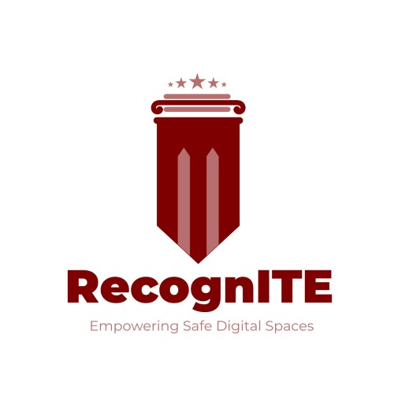

<p align="center">
<!--    -->
  
</p>

<h1 align="center">Recognize ITE Law Violation</h1>

<div align="center">
  
</div>

### Cloud Computing Path
#### Bangkit Capstone Project 2024 Batch 1
Bangkit Capstone Team ID : C241 - PS180 <br>
Here is our repository for Bangkit 2024 Capstone project - Cloud Computing

### About
RecognITE (Recognize ITE Law Violation) is a web service that allows to detect violations of the Information and Electronic Transactions (ITE) law by analyzing text. This service is currently under development and will be updated soon. The main features currently available are:
1. Neutral (0): Classification of content that does not contain violations of the law or negative elements.
2. Cyberbullying (1): Classification of content that contains elements of intimidation, insults, or harassment online.
3. Hatespeech (2): Classification of content that contains hate speech or discrimination.
4. Online Gambling (3): Classification of content that promotes or directs users to illegal online gambling activities.

## Base URL
-	http://127.0.0.1:5000/
- https://recognite-flask-4b2z2rrx2a-et.a.run.app/

## Guidance How To Run Locally
Ensure you have the following dependencies installed.
```text
Flask
tensorflow==2.15.0
pandas==2.0.3
scikit-learn==1.2.2
```

For using our NLP Model, You must clone our repository first with this following command:

`https://github.com/RecognITE-Capstone-Bangkit/Cloud-Computing.git`

after cloning the repository, go to the aplod directory and run the following command on your favorite CLI:

`python app.py`

## Index Endpoints
**Base URL :**

> `/predict`

**Method :**

> `POST`

## Netral Classification
#### Netral EndPoint : <br>
header key: 

> `content-type value:app/json`

body :
> `raw:json`

Teks :
> `{
    "text": "Hello, I am a Bangkit Academy student"
}`

Response : 
> `{
    "predicted_label": "0"
}`

## CyberBullying Classification
#### CyberBullying EndPoint : <br>
header key: 

> `content-type value:app/json`

body :
> `raw:json`

Teks :
> `{
    "text": "ternyata kamu jelek kalo di media sosial"
}`

Response : 
> `{
    "predicted_label": "1"
}`

## HateSpeech Classification
#### HateSpeech EndPoint : <br>
header key: 

> `content-type value:app/json`

body :
> `raw:json`

Teks :
> `{
    "text": "Kamu sangat Jelek"
}`

Response : 
> `{
    "predicted_label": "2"
}`

## online gambling classification
#### online gambling EndPoint : <br>
header key: 

> `content-type value:app/json`

body :
> `raw:json`

Teks :
> `{
    "text": "ayo main slot dijamin gacor"
}`

Response : 
> `{
    "predicted_label": "3"
}`
